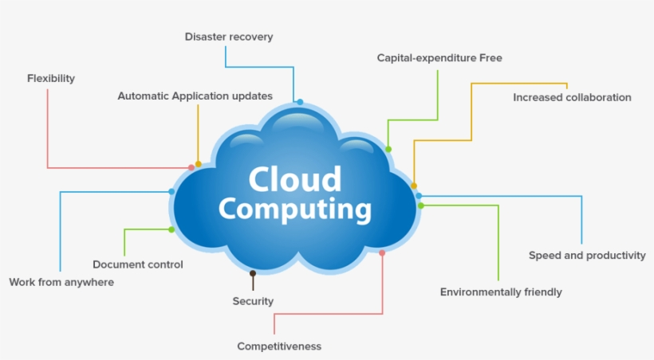

# what is DevOps?

- DevOps is a practice of philosophies that aims to bridge the gap
between software development and operations teams.

- The main goal of a DevOps engineer is to achieve faster more reliable software delivery.

- Devops focuses on automation, collaboration, continuous integration & delivery,
as well as monitering and feedback.

# Benefits of DevOps

- DevOps can bring alot of benefits to a business. It emphasises continuous delivery and deployment
which allows new features and updates to be released more frequently.

- Practices such as automatic testing and continuous monitoring can help businesses find and fix issues before
they can impact customers.

- DevOps encourages collaboration and communication between teams which improves the overall efficiency of an organisation.

# What is cloud computing and AWS?

Cloud Computing allows users to access and use computing resources over the internet.
These resources can include servers, data storage, databases, applications, computer hardware and others.

# How does it fit into DevOps?

Cloud computing is an essential part of DevOps because it enables teams to deploy and manage their applications and infrastructure more effectively.
Cloud environments can be created so that applications can be built and tested on the same platforms and machines. This reduces issues when
passing applications or software between people and teams who use different computers.

# Benefits of cloud computing

- Cost-effective for businesses
- Good security of data
- Ease of use and customisable
- Access control for different users within your cloud service
- High levels of reliability
- Flexible due to being accessible from anywhere with internet connection

# Who's using AWS?

Amazon Web Services is used by a wide range of large companies. Some of the notable companies that use AWS include:

- Netflix
- Airbnb
- Spotify
- LinkedIn
- Facebook
- Dropbox
- Expedia
- General Electric
- Unilever
- Pfizer

These are just a few examples.